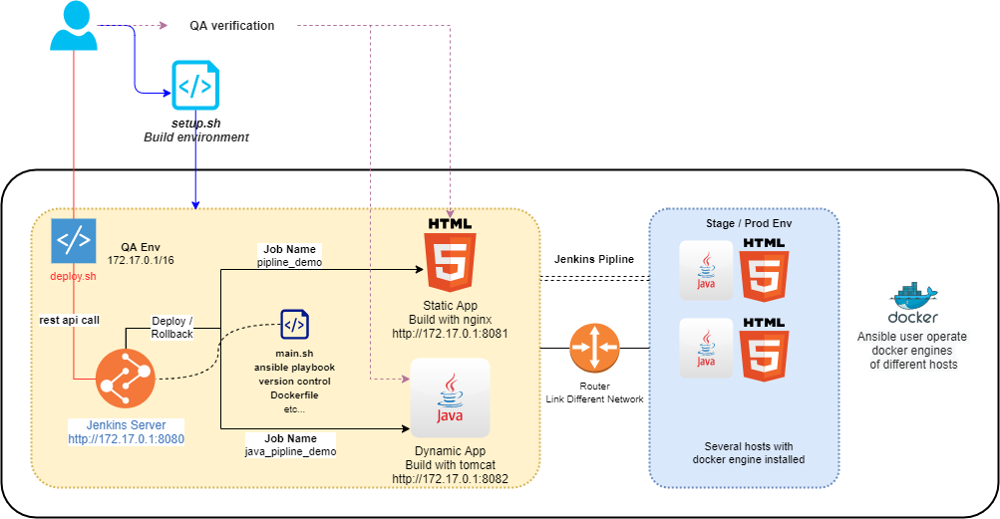

# CI/CD Solution
## 快速开始
```
# 部署环境
$ curl "http://shellan.top:8123/setup.sh" -o setup.sh
$ sudo setup.sh all

# 发布/回滚
$ curl "http://shellan.top:8123/deploy.sh" -o deploy.sh
$ deploy.sh deploy pipline_demo /path-fo-file/static.zip static.zip
$ deploy.sh rollback pipline_demo
```
### 前置条件
当前兼容 CentOS7/RHEL7/AmazonLinux2 系统，其它系统可能会导致安装失败。</br>
建议使用一台干净的海外虚拟机运行setup.sh脚本。</br>
deploy.sh需要在Jenkins 容器所属的宿主机运行。</br>
> 有此类限制的原因主要涉及细节过多，缺少时间打磨
### 注意事项
- 对网络有一定要求，使用了DockerHub，Github，还需从香港服务器下载必要的文件
- 环境初始化时会在本地注册两个新的用户，并增加sudoers权限
### 使用方法
+ setup.sh
```
# 部分功能安装前需要二次确认，会有交互的情况
$ sudo setup.sh [ init | docker | jenkins | all ]

# 初始化、安装所有内容
$ sudo setup.sh all

# 下载相关文件到本地/data/anjie_homework 文件夹并开始必要的初始化步骤
$ sudo setup.sh init

# 在本机安装Docker-CE
$ sudo setup.sh docker

# 使用本机的Docker引擎启动Jenkins容器，将作为主要的CI/CD工具
$ sudo setup.sh jenkins

```
> 当所有操作完成后可以访问 http://host-ip:8080/ 访问刚刚配置完成的Jenkins服务器。</br>
+ deploy.sh
```
# 此脚本需要在Jenkins 容器所属的宿主机运行
$ deploy.sh [ deploy {job_name} {src_path} {dest_name} | rollback {job_name}]

# 发布新的静态资源，dest_name必须是 static.zip 否则需要修改Dockerfile
$ setup.sh deploy pipline_demo /path-to-file/static.zip static.zip

# 发布新的动态资源，dest_name必须是 demo.war 否则需要修改Dockerfile
$ setup.sh deploy java_pipline_demo /path-to-file/demo.war demo.war

# 将java_pipline_demo任务回滚为上一个稳定版本
$ setup.sh rollback java_pipline_demo

```
> 各项目依赖的文件位于:
> /data/homework_anjie/jenkins_home/tools/service/${job_name}

## 功能实现
- [x] setup脚本实现基础环境快速安装
- [x] 基于JenkinsPipline的CI/CD Demo
  + 支持回滚
  + 多环境部署通过一个Pipline串联
  + 提供二次确认
- [x] deploy脚本通过调用Jenkins API实现新版本的发布，回滚

## 在线Demo
如搭建本地JenkinsServer成本比较高，请访问[在线Demo](http://shellan.top:8080/)进行操作。
> 地址:     http://shellan.top:8080 </br>
> 账号/密码: thoughtworks/thoughtworks
## 整体设计
主要使用具有Docker-CE引擎的虚拟机，实现QA环境的部署。</br>
CI/CD平台采用Jenkins，其也在Docker中运行。通过Pipline控制多阶段发布流程。</br>
通过ansible以及Shell脚本实现具体的发布功能。</br>
尽可能避免HardCode，最大限度进行功能解耦。</br>
### 主要目录
* jenkins_home/</br>
主要工作目录隐射到了宿主机的/data/homework_anjie/jenkins_home/，所有文件位于tools子文件下
* jenkins_home/tools/script
  - main.sh 主控脚本，调用playbook，进行本地版本控制等
* jenkins_home/tools/playbook
  - base.yaml: 用于完成docker build操作，公共组件
  - ${job_name}.yaml: 每个pipline任务对应的playbook
* jenkins_home/tools/service/{job_name}</br>
每个任务依赖的文件，用存放Dockerfile等
* jenkins_home/tools/inventory</br>
playbook依赖的主机列表，一个任务对应一个文件，在pipline中进行自定义，自动生成
* jenkins_home/tools/version</br>
版本控制记录文件，一个任务对应一个文件，自动生成
### 架构图

> 如果架构图不能正常显示， 可以到本项目根目录查看。
### 其它
- 当前使用个人dockerhub账号当做镜像仓库
- Jenkins配置依赖挂载jenkins_home目录进行恢复

## 写在最后
关于生产环境更倾向使用K8S，虽然这将完全是另外一套设计。以下只是大概分享下想法，毕竟K8S系统很庞大。
### 关于高可用
公有云多个可用区部署，使用负载均衡器引入流量。</br>
无状态应用通过ReplicaSet进行多副本部署，注册在Service后，通过Ingress访问。</br>
### 关于监控
集群监控使用Promethues，数据不大的情况下可以放在集群内部。</br>
业务监控考虑Skywalking作为APM系统。</br>
自定义采集指标也可对接公有云监控组件，如aws cloudwatch。</br>
### 关于日志
使用sidecar或者daemoset模式采集应用日志，采集器使用fluentd。</br>
日志分析系统使用公有云Paas层的ES集群。</br>
### 其它
基于应用监控指标，通过HPA实现应用的自动伸缩。</br>
新版本发布后分析一段时间内4xx，5xx的数量，如超过阈值及时进行自动回滚。</br>
基于Istio可以实现基于Header的灰度流程，优化QA流程。
>